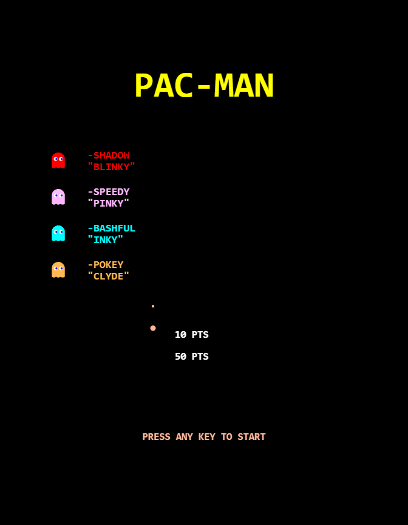
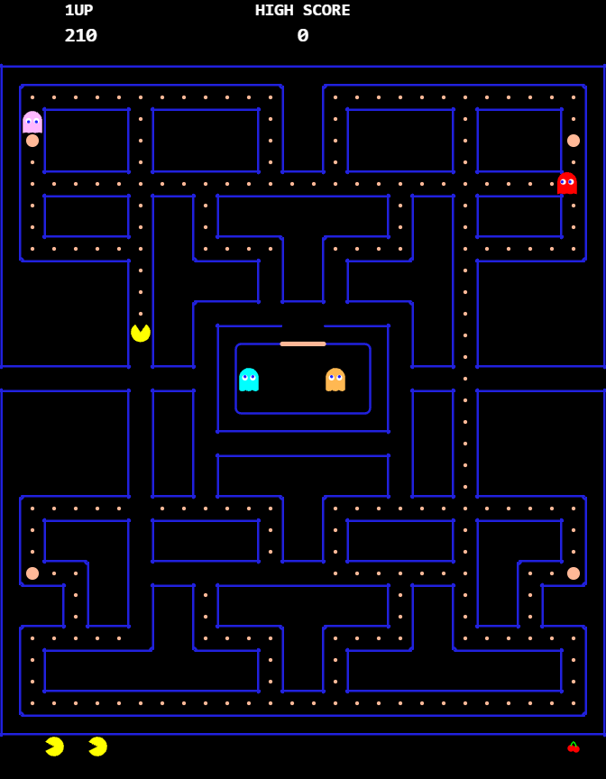
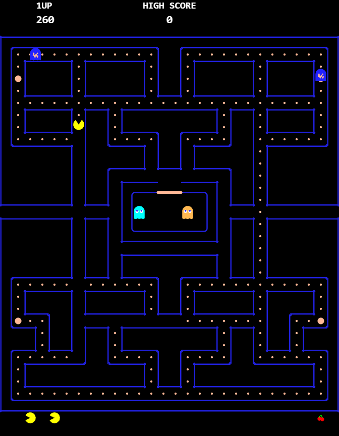
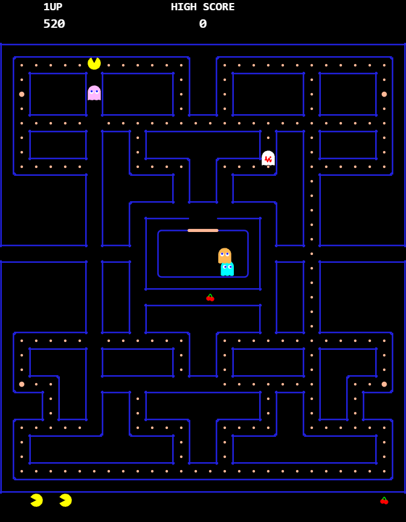

# PAC-MAN

A faithful-in-spirit clone of the 1980 Namco arcade classic, built entirely in TypeScript with raw HTML5 Canvas 2D. No game framework, no sprite sheets, no audio files — everything is drawn and generated programmatically.

<p align="center">
  
  
</p>
<p align="center">
  
  
</p>

## Play

```bash
npm install
npm run dev
```

Open `http://localhost:5173` and press any key to start.

## Controls

| Key | Action |
|---|---|
| Arrow keys / WASD | Move |
| P / Escape | Pause |
| M | Mute |
| Swipe (mobile) | Move |
| Tap (mobile) | Pause |

## Features

- **Authentic maze** — The original 28x31 tile layout with outline-based wall rendering, rounded corners, and a proper ghost house with door
- **Ghost AI** — All four ghosts with unique chase targeting (Blinky chases directly, Pinky ambushes 4 tiles ahead, Inky flanks using Blinky's position, Clyde retreats when close), scatter mode corner targets, and frightened random movement
- **Scatter/Chase cycles** — 7-phase timer alternating between scatter and chase, with level-specific timings
- **Frightened mode** — Power pellets turn ghosts blue with wavy mouths; ghosts flash white as the timer runs out; eating ghosts scores 200/400/800/1600 with floating score popups
- **Ghost house** — Proper release logic with personal dot counters, global dot counter (after death), and inactivity timer
- **Cruise Elroy** — Blinky speeds up when few dots remain
- **Fruit bonuses** — 8 fruit types (cherry through key) that appear at dot thresholds 70 and 170, with level-appropriate scoring
- **Death animation** — Pac-Man's mouth opens wide then shrinks away upward
- **Level progression** — Increasing difficulty across levels with faster ghosts, shorter fright times, and different fruit
- **Procedural audio** — All sound effects generated with Web Audio API oscillators: waka-waka, power pellet, ghost eaten, death, fruit, extra life, intro jingle, plus looping siren, frightened, and retreat sounds
- **Pause & mute** — Full pause overlay, mute indicator, sound loops properly stop and resume
- **Touch controls** — Swipe for direction, tap to pause
- **High score** — Persisted in localStorage across sessions
- **Extra life** — Awarded at 10,000 points

## Tech Stack

- **TypeScript** — Strict mode, zero `any` in game code
- **HTML5 Canvas 2D** — All rendering at 3x native resolution (672x864), CSS-scaled to fit viewport
- **Web Audio API** — Procedural sound synthesis with oscillators, gain nodes, and LFOs
- **Vite** — Dev server and bundling
- **Puppeteer** — Automated visual testing (`screenshot.mjs`)

## Architecture

```
src/
  core/          Constants, types, input handling, math helpers
  entities/      Ghost class, ghost targeting AI
  maze/          Maze data and tile management
  rendering/     Canvas renderer (maze, entities, HUD, fruit)
  states/        Generic finite state machine
  systems/       Level configs, sound manager
  game.ts        Main game loop and state orchestration
  main.ts        Entry point
```

## License

MIT
